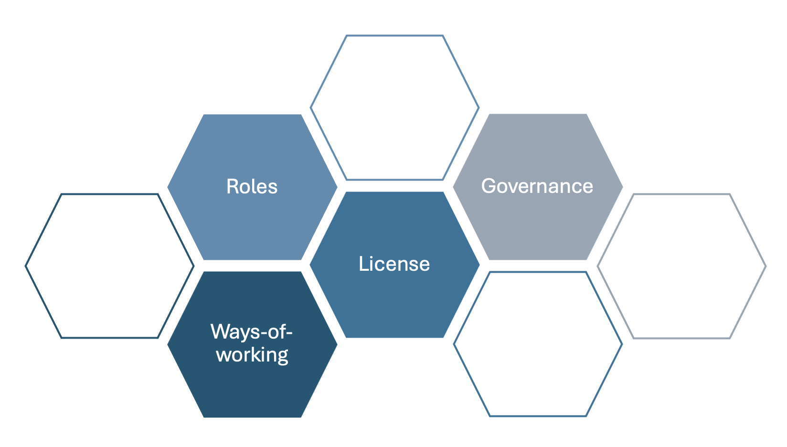
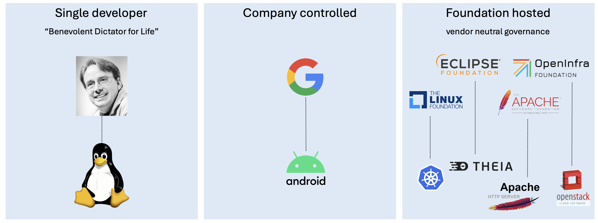

## Open Source Projects, Culture and Roles

It is important for everybody who engages in the open source ecosystem to understand its structure, culture, and social norms. This section provides a brief overview of the governance of open source projects, the purpose of open source foundations and the various roles developers within an open source project can play.

_Open source projects differ in various aspects._

The open source ecosystem is extremely heterogenous, i.e., open source projects differ greatly in terms of size of the development community, industry adoption, and governance models.
In terms of size, projects range from single-developer hobbyist activities to large scale industry driven projects such as the Linux kernel, OpenStack, or Kubernetes[^lf-census-ii].

[^lf-census-ii]: [Census II of Free and Open Source Software — Application Libraries](https://www.linuxfoundation.org/research/census-ii-of-free-and-open-source-software-application-libraries){:target="_blank"}

_Different flavors of governance models of open source projects._
